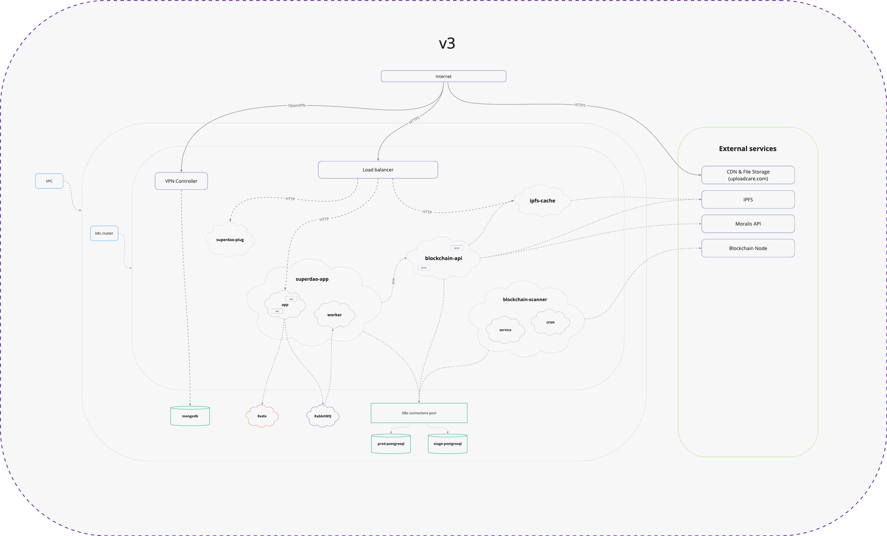

# DAO platform app by Superdao
Superdao - is an all-in-one DAO platform that makes it easy to start and operate decentralized autonomous organizations. On Superdao, you can create a DAO in one click, generate and upgrade smart contracts, use built-in member directory, treasury dashboard, contributor management, newsfeed + do even more with third-party apps. 

Here is a [product demo video](https://youtu.be/3kQ1-UPp2VM) to show all the features available on Superdao.

A substantial part of DAO platform is Superdao OS ([article](https://mirror.xyz/superdaoapp.eth/SNn6Bf8AZKKNp9YQjx6ZSzRw8NAldbEB2ji4-qhiJ7U), [repo](https://github.com/superdao-inc/dao-os)) — a smart contract framework to build and run organizations on the blockchain.

## First start

- Install project dependencies - `pnpm install`
- Bring up the database and cache services - `docker-compose up -d`
- Copy the configuration files - `cp apps/superdao-backend/.env.example apps/superdao-backend/.env && cp apps/superdao-frontend/.env.example apps/superdao-frontend/.env`
- Synchronize the data schema with the database - `pnpm --filter=superdao-backend migrate`
- Generate graphql types - `pnpm codegen`
- Prepare sources in ui-tests (only for autotesters) - `pnpm init`
- Run the server in development mode - `pnpm dev`

## Blockchain API:

- For full functionality, you need to provide the URL of the service to the environment variable `APP_BC_SERVICES_URL` that will provide endpoint for `getMemberNftsByDaoAddresses` method

## Libraries and technologies

- [Next.js](https://nextjs.org/docs/getting-started) - a framework used for convenient work with SSR
- [TypeORM](https://typeorm.io/#/) - a library used to describe entity schemas in the database and compose queries
- [styled-components](https://styled-components.com/) - library used to describe block styles
- [luxon](https://moment.github.io/luxon/#/?id=luxon) - library used to work with time and date conversion
- [zod](https://github.com/colinhacks/zod#basic-usage) - a library used to describe API request patterns and set input restrictions
- [react-query](https://react-query.tanstack.com/overview) - library used to store and update data from the API on the client

## Architecture diagram

## Debug server app (VSCode)

- Put a breakpoint in the code
- Run app: `pnpm sd dev:watch`
- From the VSCode sidebar select **Debug and run**
- Click on the green **Play** icon or the **F5** key
- Through any convenient HTTP client, we call query / mutation, we hit a breakpoint)

## Contributors

We are publishing this repository with no commit history, so here is a list of developers, testers and DevOps who contributed

Akim Mamedov,
Aleksandr Antsiferov,
Aleksandr Khaustov,
Alexander Kolobov,
Alexey Vasyukov,
Anna Linnik,
Anton Iutin,
Anton Movshin,
Arina Kustanovich,
Artur Dedela,
Artur Mullakhmetov,
Balzhinimaev Lopson,
Dan Melnichuk,
Denis Makeev,
Dmitrii Erokhin,
Dmitry Prokoshev,
Dmitry Rudanovsky,
Eduard Tishkin,
Elizaveta Kharchenko,
Elshan Dzhafarov,
Fedor Rychkov,
German Iskhakov,
Grisha Zelensky,
Konstantin Novosad,
Lopson Balzhinimaev,
Maksim Gubyshev,
Maxim Kochukov,
Maxim Monakhov,
Maxim Pinchuk,
Mikhail Romanov,
Mikhail Serov,
Mikhail Sitnikov,
Misha Berezin,
Nazhmudin Baymurzaev,
Nikita Landa,
Nikita Panchenko,
Nikolay Evstafev,
Robert Gadeev,
Semyon Makhaev,
Sergei Karavai,
Sergey Zavarzin,
Tanat Kamalov,
Tigran Avagyan,
Vitali Litvinovich,
Vladimir Terekhin,
Vladimir Vlasiuk
